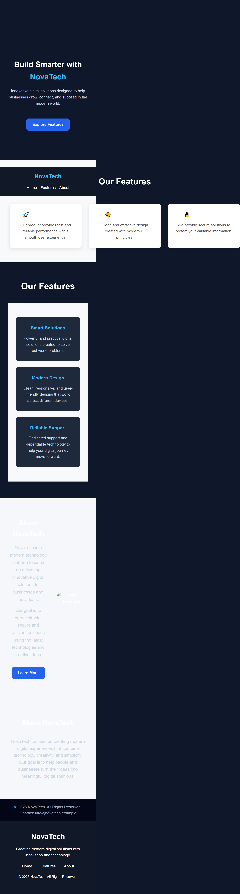

# NovaTech Landing Page

## Task
Level 1 - Task 1: Landing Page

## Description
NovaTech is a responsive landing page created using HTML and CSS. 
The project focuses on clean UI design, structured layout, and responsive behavior across different screen sizes.

## Features
- Responsive navigation bar
- Hero section
- Features section
- About section
- Footer
- Mobile and tablet responsive design

## Technologies Used
- HTML5
- CSS3

## Project Preview

### Screenshot

### Demo Video

Demo video is available in the project folder:
`WebDev-L1-LandingPage/demo-video.mp4`

## Author
Meerab Asif
